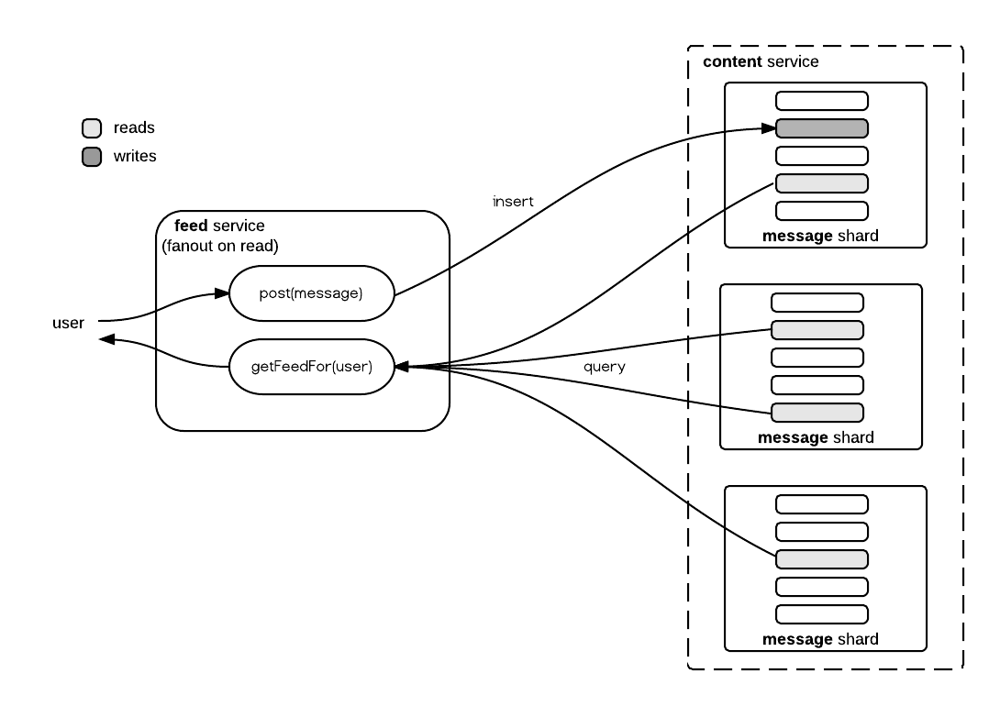
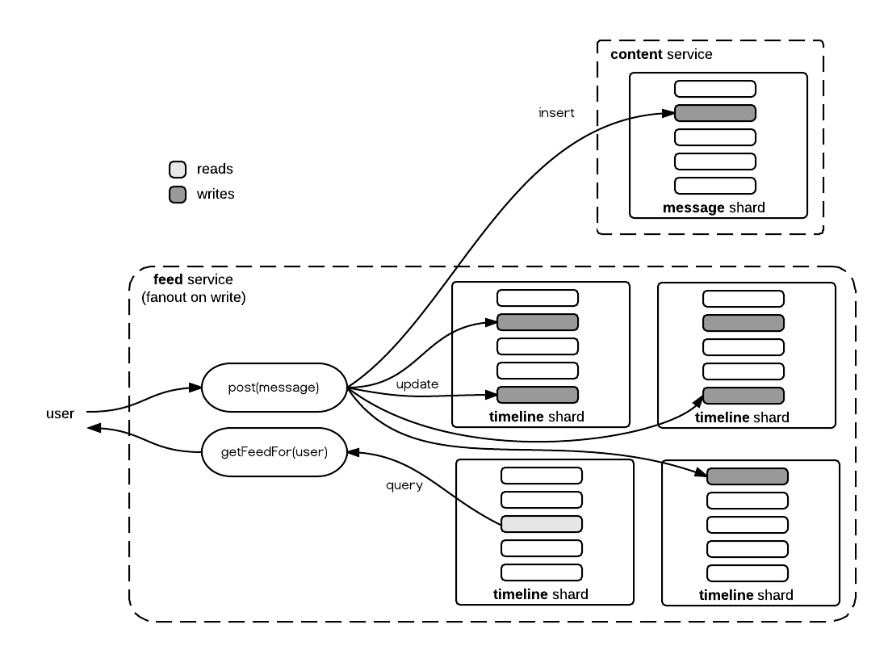

## Feed Service

The feed service performs the following basic functions :

* Receive posts from a user
* Forwards the content of the post to the Content Service
* Serves timeline feeds for all users based on the posts of accounts they follow

One major design decision for a feed service is how and when to assemble the timeline feed for users. Socialite abstracts this service via the [FeedService](../src/main/java/com/mongodb/socialite/services/FeedService.java) interface and provides a series pluggable reference implementations to demonstrate various models in action. The implementations each fall into the two broad categories.

### Fanout on Read

The fanout on read approach is the simplest feed service implementation. Socialite implements this model in the [FanoutOnRead](../src/main/java/com/mongodb/socialite/feed/FanoutOnRead.java) service class.

This approach does not materialise the feed of a user at all until it has been requested via the service getFeedFor() API. Posting a message simply forwards the message to the ContentService where it is stored indexed by Id and user. When a request arrives for a particular user’s feed, the service simply creates a query for the most recent content of all accounts followed by that user.

#### Advantages

* **Simple implementation** - almost pass through to the content service
* **Storage efficient** - only stores a single copy of message and its metadata

#### Disadvantages

* **Multi-shard random IO** - in a large sharded content cluster, assembling a feed will typically require reads that span a number of shards. These queries will involve a lot of random IO and often read more data than is necessary (each shard must supply enough messages to satisfy the entire query in the event that no other shard has and matching data).
* **No caching** - if two reads of the same user’s timeline occurs in quick succession, the entire query must be re-processed irrespective of whether the result will have changed.
* **Large following lists** - gathering the timeline for a user with large follower lists will be very expensive and at some point would require splitting in to separate queries an manual collation.

#### When to Use

The Fanout on Read model is typically best suited for systems where :

* Timelines are viewed far less frequently than posts are made
* Number of users and amount of content is smaller scale and unsharded
* Users typically follow few people
* It is very common for older sections of the timeline to be viewed

### Fanout on Write

This approach maintains a persistent timeline for each user that is updated as posts from followed users occur. In general, the advantages of this model revolve around the ability to read the timeline feed for a user from far fewer documents (sometimes as few as one) and always from a single shard.

Of course updating persistent timelines for each of a user’s followers when a post arrives is also going to incur a high write overhead as compared to fanout on read, especially for users with a high follower account.

Socialite implements three variations of the model which differ by how the user timeline entries are organised in MongoDB documents, each with its own unique advantages.

### Fanout on Write - Timed Buckets

This variant of fanout on write is implemented in Socialite by the [FanoutOnWriteTimeBuckets](../src/main/java/com/mongodb/socialite/feed/FanoutOnWriteTimeBuckets.java) service class. The model maintains a collection of “bucket” documents in the timed_buckets collection that are filled with posts for a user’s timeline for a given (configurable) time period.

For example, by default, all of the posts that belong in a users timeline for any given day will be stored in an array within the same document. Documents are automatically “upserted” for a user on any day for which a post exists. A sample of data organised this way would look like this :

    $ db.timed_buckets.find().pretty()
    {
        "_id" : { "_t" : 516935, "_u" : "jsr" },
        "_c" : [
            {"_id" : ObjectId("...dc1"), "_a" : "djw", "_m" : "message from daz"},
            {"_id" : ObjectId("...dd2"), "_a" : "ian", "_m" : "message from ian"}
        ]
    }
    {
        "_id" : { "_t" : 516935, "_u" : "ian" },
        "_c" : [
            {"_id" : ObjectId("...dc1"), "_a" : "djw", "_m" : "message from daz"}
        ]
    }
    {
        "_id" : { "_t" : 516934, "_u" : "jsr" },
        "_c" : [
            {"_id" : ObjectId("...da7"), "_a" : "ian", "_m" : "earlier from ian"}
        ]
    }

These documents show that the bucket id is a combination of the time (a monotonically increasing identifier for each day) and userId. This means that in MongoDB, an upsert to the “container of the day” for a given user will either cause the whole document to be created or append to the content array (“_c” field) of a document that already exists. If no updates for a given user’s timeline exist for any given day, the document for that day simply won’t exist.

The main advantage of this model specifically is the simplicity of the upsert command for creating or appending to a timeline document for a given time period. This makes writes to the timeline collection efficient from a number of operations point of view while still using batching when users receive multiple messages over a given time period.

Disadvantages of this model include :

* Timeline documents are constantly resized (potentially resulting in many document moves in underlying storage)
* Documents will vary in size depending on activity for the users timeline. In the case where a user receives just one message per time period, this storage model is not efficient. At the other extreme, this could also lead to very large documents for popular users depending on the bucket time range.

### Fanout on Write - Sized Buckets

This variant of fanout on write is implemented in Socialite by the [FanoutOnWriteSizedBuckets](../src/main/java/com/mongodb/socialite/feed/FanoutOnWriteSizedBuckets.java) service class. The model maintains a collection of “bucket” documents in the sized_buckets collection that are filled with a (configurable) set number of posts for a user’s timeline.

While the documents for the timeline look quite similar to the timed buckets approach, there are a few important differences. The example below is the same data as seen in the timed_buckets section, however the messages for the user “jsr” are all in a single document. This is because the same document (per user) is used in this model to hold timeline messages until it has reached a pre-determined size at which point a new one will be created.

    $ db.sized_buckets.find().pretty()
    {
        "_id" : ObjectId("...122"),
        "_c" : [
            {"_id" : ObjectId("...da7"), "_a" : "ian", "_m" : "earlier from ian"},
            {"_id" : ObjectId("...dc1"), "_a" : "djw", "_m" : "message from daz"},
            {"_id" : ObjectId("...dd2"), "_a" : "ian", "_m" : "message from ian"}
        ],
        "_s" : 3,
        "_u" : "jsr"
    }
    {
        "_id" : ObjectId("...011"),
        "_c" : [
            {"_id" : ObjectId("...dc1"), "_a" : "djw", "_m" : "message from daz"}
        ],
        "_s" : 1,
        "_u" : "ian"
    }

This model (as implemented) also suffers from document resizing as messages are added, however it would be feasible to devise a pre-allocation scheme for these documents, particularly if the message size is uniform, capped or otherwise predictable.

One disadvantage specific to this model is that the insertion logic is more complicated. The implementation must use a findAndModify command rather than an upsert to detect when a new document needs to be created (i.e when the message count exceeds the target bucket size). In addition to this the client also uses a separate insert operation to create the new bucket.

### Fanout on Write - Cache

The two fanout on write models discussed so far essentially build and retain a persistent version of the timeline for each user for all time. The advantage of course is that scrolling back into a user's timeline is very simple by looking through the past timeline buckets by descending time. This model, however, does have some significant drawbacks :
* There is a lot of duplication of the original message, especially in highly connected networks where the average user has a lot of followers.
* Users that never read a timeline are having it persistently built anyway.
* In many social networks, only very recent messages are accessed routinely

Another approach is to store the persistent timeline of a user in a single cache document that is finite in size and only maintain this cache document for active users. Such an approach is implemented in Socialite by the [FanoutOnWriteToCache](../src/main/java/com/mongodb/socialite/feed/FanoutOnWriteToCache.java) service class.

    $ db.timeline_cache.find().pretty()
    {
        "_id" : “jsr”,
        "_c" : [
            {"_id" : ObjectId("...da7"), "_a" : "ian", "_m" : "earlier from ian"},
            {"_id" : ObjectId("...dc1"), "_a" : "djw", "_m" : "message from daz"},
            {"_id" : ObjectId("...dd2"), "_a" : "ian", "_m" : "message from ian"}
        ]
    }
    {
        "_id" : “ian”,
        "_c" : [
            {"_id" : ObjectId("...dc1"), "_a" : "djw", "_m" : "message from daz"}
        ]
    }

While the documents shown here look similar to the previous bucketing approaches, this model maintains a single “capped” array of timeline entries for each user that is actively reading their timeline. When a message needs to be inserted into a user’s timeline, Socialite executes something similar to the following update :

    db.timeline_cache.update(
        {"_id" : "ian"},
        {$push : { "_c" : {
            $each : [{"_id" : ObjectId("...dc1"), "_a" : "djw", "_m" : "new message"}],
            $slice : -50 }
        }},
        false, false)

This update has two subtle yet important characteristics :

1. The [$slice](http://docs.mongodb.org/manual/reference/operator/update/slice/) operator limits the size of the timeline cache to a configurable number of entries (50 in this example).
2. Setting the upsert flag to false means that no write will occur at all if the users cache document does not exist.

In order to avoid storing and maintaining a timeline cache for dormant or bot users which never access their account, the cache document is only created on read and is initialized by falling back to a fanout-on-read approach. If a user scrolls back in their timeline beyond the limit of the cache, the system also falls back to fanout on read.

#### When to Use

The fanout on write (cache) model has several advantages in the following use cases :

* Timeline history (beyond what is cached) is rarely accessed
* There are many inactive/bot users that do not read timelines
* Timeline storage is premium (i.e using SSD or Provisions IOPS)

### Content Embedding vs Linking

Each of the fanout on write models described also support configuration of which content details actually get stored in the timeline cache. For simple content like short messages, it may make sense to embed the message id, the author id and the message itself.

For more complex content, or in situations where the client may be displaying only parts of a large complex timeline cache, it may be preferable to embed only content_id and author_id into the timeline and retrieve the content itself on demand from the Content Service.

Some considerations for the difference between these two approaches are :

* Embedding rich content can make the cache document sizes unpredictable. This may result in the cache documents needing to be moved many times.
* Linking to content will place a larger load on the Content Service. This may require the Content Service to be spread across more shards.

